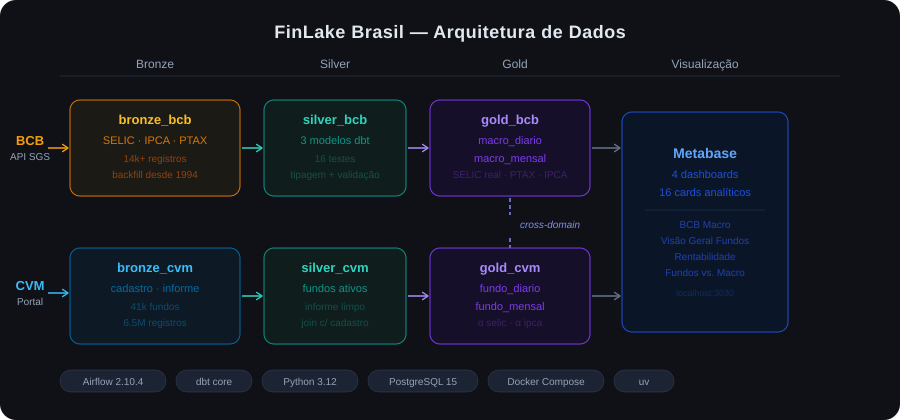

# FinLake Brasil 🇧🇷

> Plataforma de dados financeiros brasileiros com Medallion Architecture completa e Data Mesh — construída com Python, dbt, Airflow e PostgreSQL.

[](https://www.python.org/)
[](https://www.getdbt.com/)
[](https://airflow.apache.org/)
[](https://www.postgresql.org/)
[](https://www.metabase.com/)
[](https://www.docker.com/)

---

## Visão Geral

O **FinLake Brasil** é uma plataforma local de dados financeiros que ingere, transforma e disponibiliza dados públicos do Banco Central do Brasil (BCB) e da Comissão de Valores Mobiliários (CVM), organizados em dois domínios independentes seguindo os princípios de **Data Mesh**.

A arquitetura cobre o ciclo completo **Bronze → Silver → Gold → Visualização** para ambos os domínios, com orquestração via Airflow, transformações via dbt e dashboards analíticos no Metabase.

### Por que este projeto existe

Plataformas financeiras de dados são o ambiente mais exigente para um Data Engineer: séries temporais longas, schemas que mudam entre anos, volumes que chegam a milhões de linhas e análises cross-domain que dependem de múltiplas fontes. O FinLake Brasil simula esse ambiente com dados reais e públicos, demonstrando decisões de arquitetura que você encontra em produção — não em tutoriais.

---

## Arquitetura



<details>
<summary>Ver diagrama em texto (ASCII)</summary>

```
┌─────────────────────────────────────────────────────────────────────────┐
│                          FINLAKE BRASIL                                 │
│                                                                         │
│  ┌──────────────────────────┐    ┌──────────────────────────────────┐  │
│  │   DOMÍNIO BCB (Macro)    │    │      DOMÍNIO CVM (Fundos)        │  │
│  │                          │    │                                  │  │
│  │  Fonte: api.bcb.gov.br   │    │  Fonte: dados.cvm.gov.br         │  │
│  │  SELIC · IPCA · PTAX     │    │  Cadastro de Fundos · Informes   │  │
│  │                          │    │                                  │  │
│  │  ┌──────────────────┐    │    │  ┌──────────────────────────┐   │  │
│  │  │ BRONZE           │    │    │  │ BRONZE                   │   │  │
│  │  │ bronze_bcb.*     │    │    │  │ bronze_cvm.cadastro       │   │  │
│  │  │ 14k+ registros   │    │    │  │ bronze_cvm.informe_diario │   │  │
│  │  │ backfill desde   │    │    │  │ 6.5M rows (2024)          │   │  │
│  │  │ 1994–2000        │    │    │  │                          │   │  │
│  │  └────────┬─────────┘    │    │  └──────────┬───────────────┘   │  │
│  │           │ dbt          │    │             │ dbt               │  │
│  │  ┌────────▼─────────┐    │    │  ┌──────────▼───────────────┐   │  │
│  │  │ SILVER           │    │    │  │ SILVER                   │   │  │
│  │  │ silver_bcb.*     │    │    │  │ silver_cvm.fundos         │   │  │
│  │  │ 16 dbt tests     │    │    │  │ silver_cvm.informe        │   │  │
│  │  └────────┬─────────┘    │    │  └──────────┬───────────────┘   │  │
│  │           │ dbt          │    │             │ dbt               │  │
│  │  ┌────────▼─────────┐    │    │  ┌──────────▼───────────────┐   │  │
│  │  │ GOLD             │◄───┼────┼──│ GOLD (cross-domain)      │   │  │
│  │  │ gold_bcb.*       │    │    │  │ gold_cvm.fundo_diario     │   │  │
│  │  │ macro_diario     │    │    │  │ gold_cvm.fundo_mensal     │   │  │
│  │  │ macro_mensal     │    │    │  │ alpha_selic · alpha_ipca  │   │  │
│  │  └────────┬─────────┘    │    │  └──────────┬───────────────┘   │  │
│  └───────────┼──────────────┘    └─────────────┼──────────────────┘  │
│              │                                 │                       │
│              └──────────────┬──────────────────┘                      │
│                             │                                          │
│                    ┌────────▼────────┐                                 │
│                    │   METABASE      │                                 │
│                    │  localhost:3030 │                                 │
│                    │ 4 dashboards    │                                 │
│                    │ 16 cards        │                                 │
│                    └─────────────────┘                                 │
│                                                                         │
│  Orquestração: Apache Airflow 2.10.4  (localhost:8080)                 │
│  Storage: PostgreSQL 15              (localhost:5433)                  │
└─────────────────────────────────────────────────────────────────────────┘
```

</details>

### Decisões de Design

**Por que dois domínios separados?**
O BCB e a CVM são fontes independentes com contratos diferentes, frequências de atualização distintas e equipes de negócio que as consomem separadamente. Manter os domínios isolados — cada um com seus schemas, DAGs e modelos dbt — aplica o princípio de _domain ownership_ do Data Mesh: mudanças em um domínio não afetam o outro.

**Por que o Gold faz cross-domain?**
A análise mais valiosa da plataforma — comparar a rentabilidade de fundos de investimento com o benchmark macroeconômico (SELIC, IPCA) — exige dados dos dois domínios. O cross-domain acontece apenas na camada Gold, que é a camada de consumo, preservando a independência das camadas inferiores.

**Por que PostgreSQL em todas as camadas?**
Consistência de stack. O Metabase conecta nativamente, o Airflow usa o mesmo banco como metadata store, e a complexidade operacional fica mínima. Para o volume desta plataforma (~7M rows), PostgreSQL entrega performance mais que suficiente sem introduzir complexidade de um lakehouse distribuído.

**Por que dbt para transformações?**
Rastreabilidade e testabilidade. Cada transformação Silver → Gold é um modelo SQL versionado com testes declarativos. O `dbt docs` gera a linhagem de dados automaticamente — algo que pipelines Python avulsos não entregam.

---

## Fontes de Dados

### Domínio BCB — Macroeconomia Brasileira

| Série | Código BCB | Frequência | Histórico | Registros |
|---|---|---|---|---|
| SELIC Over (% a.d.) | 11 | Diária | desde 2000 | ~6.600 |
| IPCA (% a.m.) | 433 | Mensal | desde 1994 | ~381 |
| PTAX (R$/USD) | 1 | Diária | desde 1999 | ~6.856 |

API pública: `https://api.bcb.gov.br/dados/serie/bcdata.sgs.{codigo}/dados`

> A API do BCB tem limite de janela de consulta. O cliente implementa _chunking_ automático de 9 anos para contornar o limite sem intervenção manual.

### Domínio CVM — Fundos de Investimento

| Fonte | Dados | Volume |
|---|---|---|
| Cadastro de fundos | 41.107 fundos (todos os tipos, todas as situações) | Snapshot atual |
| Informe diário 2024 | Cota, PL, captação, resgates, cotistas | 6.514.571 registros |

Portal público: `https://dados.cvm.gov.br/`

---

## Stack

| Camada | Tecnologia | Versão | Papel |
|---|---|---|---|
| Linguagem | Python | 3.12 | Ingestão, scripts, DAGs |
| Transformação | dbt-core | latest | Models Silver e Gold |
| Orquestração | Apache Airflow | 2.10.4 | Scheduling e dependências |
| Storage | PostgreSQL | 15 | Todas as camadas |
| Visualização | Metabase | latest | Dashboards analíticos |
| Containerização | Docker Compose | — | Profiles: default e full |
| Ingestão BCB | python-bcb | latest | Cliente da API SGS |

---

## Domínios e Camadas em Detalhe

### Domínio BCB

**Bronze** — `schema: bronze_bcb`

DAG `dag_bronze_bcb` · `@daily`

Ingere diretamente da API SGS do BCB. Na primeira execução (tabela vazia), carrega o histórico completo de cada série. Nas execuções subsequentes, carrega apenas os novos registros desde o último ponto. Idempotente: reprocessamento seguro.

```
bronze_bcb.selic_daily    — taxa SELIC over diária
bronze_bcb.ipca_monthly   — IPCA mensal
bronze_bcb.ptax_daily     — cotação PTAX dólar
```

**Silver** — `schema: silver_bcb`

DAG `dag_silver_bcb` · `@daily` · depende de `dag_bronze_bcb`

Modelos dbt com limpeza, tipagem correta e validações. 16 testes declarativos cobrindo unicidade, not-null e ranges válidos.

**Gold** — `schema: gold_bcb`

DAG `dag_gold_bcb` · `@daily` · depende de `dag_silver_bcb`

Dois modelos analíticos finais:

- `macro_diario` — série diária unificada: SELIC over anualizada, PTAX
- `macro_mensal` — série mensal: SELIC real (descontado IPCA), IPCA acumulado 12 meses, PTAX média mensal

> A SELIC real calculada no `macro_mensal` é o benchmark principal usado pelo cross-domain CVM para calcular o alpha dos fundos.

---

### Domínio CVM

**Bronze** — `schema: bronze_cvm`

Duas DAGs independentes:

- `dag_bronze_cvm_cadastro` · `@daily` — espelha o cadastro de fundos da CVM (SCD Tipo 1, estado atual)
- `dag_bronze_cvm_informe` · `@monthly` — baixa e ingere os informes diários do mês anterior

O schema do informe mudou em 2024 (campo `CNPJ_FUNDO_CLASSE`). O loader normaliza a diferença transparentemente.

**Silver** — `schema: silver_cvm`

DAG `dag_silver_cvm` · depende do Bronze CVM

- `silver_cvm.fundos` — universo de fundos operacionais: `EM FUNCIONAMENTO NORMAL` + `EM LIQUIDAÇÃO`. Fundos cancelados (maioria do histórico desde os anos 90) ficam fora.
- `silver_cvm.informe` — série temporal limpa com tipos corretos e valores validados. JOIN com cadastro feito aqui — fundos sem match no cadastro são marcados como `fundo_sem_cadastro` mas não descartados (dado real tem gaps).

**Gold** — `schema: gold_cvm`

DAG `dag_gold_cvm` · depende de `dag_silver_cvm` e `dag_gold_bcb` (paralelos)

- `fundo_diario` — 6.514.571 rows. Rentabilidade diária via LAG na cota. `NUMERIC(20,6)` para cobrir outliers extremos de fundos que começam com cota próxima de zero.
- `fundo_mensal` — 312.772 rows. Agrega o informe diário por mês: PL médio, captação líquida, rentabilidade mensal. Cross-domain: `alpha_selic` e `alpha_ipca` calculados via JOIN com `gold_bcb.macro_mensal`.

> Três bugs reais descobertos e corrigidos no build: `COUNT(DISTINCT)` não existe como window function no PostgreSQL (solução: CTE separada), overflow em `NUMERIC` para rentabilidades extremas e `tp_fundo` no `GROUP BY` quebrando para CNPJs que mudam de tipo no mês.

---

## Dashboards Metabase

### Dashboard BCB Macro

Análise macroeconômica histórica do Brasil.

| Card | Tipo | Dados |
|---|---|---|
| SELIC Real Histórica | Linha | `gold_bcb.macro_mensal` |
| PTAX Mensal | Linha | `gold_bcb.macro_mensal` |
| IPCA Acumulado 12 meses | Linha | `gold_bcb.macro_mensal` |

### Dashboards CVM

**Dashboard 1 — Visão Geral dos Fundos**

Panorama do universo de fundos de investimento ativos.

| Card | Descrição |
|---|---|
| Total de fundos ativos | Contagem por situação |
| Distribuição por tipo de fundo | AÇÕES, RENDA FIXA, MULTIMERCADO... |
| PL total por tipo | Patrimônio Líquido agregado |
| Evolução do PL total | Série mensal 2024 |

**Dashboard 2 — Rentabilidade**

Ranking e análise de performance dos fundos vs. benchmarks.

| Card | Descrição |
|---|---|
| Top 10 fundos por rentabilidade acumulada 2024 | Ranking anual |
| Distribuição de alpha vs. SELIC | Histograma |
| Distribuição de alpha vs. IPCA | Histograma |
| Alpha médio por tipo de fundo | Barras comparativas |
| Top gestores por alpha SELIC médio | Ranking de gestores |

**Dashboard 3 — Fundos vs. Macro**

Comparação direta dos fundos com os benchmarks BCB.

| Card | Descrição |
|---|---|
| Captação líquida mensal por tipo | Fluxo de capital 2024 |
| Rentabilidade média por tipo vs. SELIC | Linha dupla |
| Rentabilidade média por tipo vs. IPCA | Linha dupla |
| Top 10 fundos por PL médio | Ranking patrimonial |

---

## Estrutura do Projeto

```
finlake-brasil/
│
├── dags/
│   ├── domain_bcb/
│   │   ├── dag_bronze_bcb.py         # Ingestão SELIC/IPCA/PTAX
│   │   ├── dag_silver_bcb.py         # dbt run silver
│   │   ├── dag_gold_bcb.py           # dbt run gold
│   │   └── ingestion/
│   │       ├── bcb_client.py         # Cliente API SGS com chunking
│   │       └── loaders.py            # Loaders idempotentes
│   └── domain_cvm/
│       ├── dag_bronze_cvm_cadastro.py
│       ├── dag_bronze_cvm_informe.py
│       ├── dag_silver_cvm.py
│       └── dag_gold_cvm.py
│
├── transform/                        # Projeto dbt
│   ├── dbt_project.yml
│   ├── profiles.yml
│   └── models/
│       ├── domain_bcb/
│       │   ├── silver/
│       │   └── gold/
│       └── domain_cvm/
│           ├── silver/
│           └── gold/
│
├── scripts/
│   ├── setup_metabase_bcb.py         # Cria dashboard BCB via API
│   ├── setup_metabase_cvm.py         # Cria 3 dashboards CVM via API
│   ├── export_metabase_bcb.sh        # Exporta JSONs BCB
│   └── export_metabase_cvm.sh        # Exporta JSONs CVM
│
├── docker/
│   ├── airflow/
│   │   ├── Dockerfile
│   │   └── requirements.txt
│   ├── compose.postgres.yml
│   ├── compose.airflow.yml
│   └── compose.metabase.yml
│
├── docs/
│   └── metabase/                     # JSONs exportados dos dashboards
│
├── tests/
│   ├── domain_bcb/
│   │   ├── test_bcb_client.py
│   │   └── test_loaders.py
│   └── domain_cvm/
│
├── .claude/
│   └── sdd/archive/                  # Artefatos SDD de cada feature
│       ├── INFRA_BASE/
│       ├── BRONZE_BCB/
│       ├── SILVER_BCB/
│       ├── GOLD_BCB/
│       ├── METABASE_BCB/
│       ├── BRONZE_CVM/
│       ├── SILVER_CVM/
│       ├── GOLD_CVM/
│       └── METABASE_CVM/
│
├── docker-compose.yml                # Entry point (profiles: default, full)
├── Makefile                          # Comandos operacionais
├── pyproject.toml
├── CLAUDE.md                         # Contexto do projeto para agentes AI
├── .env.example
└── .gitignore
```

> A pasta `.claude/sdd/archive/` contém os artefatos completos de cada feature: BRAINSTORM, DEFINE, DESIGN, BUILD_REPORT e SHIPPED. Esses artefatos documentam o raciocínio de arquitetura por trás de cada decisão — não apenas o código resultante.

---

## Como Rodar Localmente

### Pré-requisitos

- Docker Desktop com pelo menos 4GB de RAM alocada
- Python 3.12
- Git

### 1. Clone o repositório

```bash
git clone https://github.com/niltontac/finlake-brasil.git
cd finlake-brasil
```

### 2. Configure as variáveis de ambiente

```bash
cp .env.example .env
# Edite .env se necessário — os valores padrão funcionam para desenvolvimento local
```

### 3. Suba a infraestrutura

```bash
# Airflow + PostgreSQL (modo padrão)
make up

# Airflow + PostgreSQL + Metabase (modo completo)
make up PROFILE=full
```

Aguarde ~60 segundos para os containers inicializarem.

### 4. Inicialize os schemas

```bash
make init-db
```

Cria os 6 schemas no PostgreSQL: `bronze_bcb`, `silver_bcb`, `gold_bcb`, `bronze_cvm`, `silver_cvm`, `gold_cvm`.

### 5. Acesse o Airflow

Abra `http://localhost:8080`

Credenciais: definidas no `.env` (padrão: `admin` / ver `.env.example`)

Você verá 7 DAGs disponíveis. Ative-as na seguinte ordem para garantir as dependências:

```
1. dag_bronze_bcb          → aguardar conclusão
2. dag_silver_bcb          → aguardar conclusão
3. dag_gold_bcb            → aguardar conclusão
4. dag_bronze_cvm_cadastro → aguardar conclusão
5. dag_bronze_cvm_informe  → aguardar conclusão (pode levar alguns minutos)
6. dag_silver_cvm          → aguardar conclusão
7. dag_gold_cvm            → aguardar conclusão
```

> A primeira execução das DAGs BCB faz backfill histórico completo (SELIC desde 2000, IPCA desde 1994, PTAX desde 1999). A DAG de informe CVM baixa o mês anterior da CVM — ~6.5M registros.

### 6. Configure os dashboards Metabase (opcional)

```bash
# Cria os dashboards via API do Metabase
make metabase-setup-bcb
make metabase-setup-cvm
```

Acesse `http://localhost:3030` para ver os dashboards.

### Comandos úteis

```bash
make up              # Sobe Airflow + PostgreSQL
make up PROFILE=full # Sobe tudo, incluindo Metabase
make down            # Para todos os containers
make init-db         # (Re)inicializa os schemas
make reset           # Para containers + remove volumes + recria

make metabase-setup-bcb   # Cria dashboard BCB via API
make metabase-setup-cvm   # Cria 3 dashboards CVM via API
make metabase-export-all  # Exporta todos os JSONs para docs/metabase/
```

---

## Schemas PostgreSQL

```
finlake (database)
├── bronze_bcb          # Dados brutos BCB
│   ├── selic_daily
│   ├── ipca_monthly
│   └── ptax_daily
│
├── silver_bcb          # Dados BCB limpos (dbt)
│
├── gold_bcb            # Métricas macroeconômicas (dbt)
│   ├── macro_diario
│   └── macro_mensal
│
├── bronze_cvm          # Dados brutos CVM
│   ├── cadastro
│   └── informe_diario
│
├── silver_cvm          # Dados CVM limpos (dbt)
│   ├── fundos
│   └── informe
│
└── gold_cvm            # Métricas de fundos + cross-domain (dbt)
    ├── fundo_diario    # ~6.5M rows
    └── fundo_mensal    # ~312k rows
```

---

## Metodologia de Desenvolvimento

Cada feature foi desenvolvida seguindo o ciclo **SDD (Spec-Driven Development)** via AgentSpec:

```
/brainstorm  →  /define  →  /design  →  /build  →  /ship
```

Os artefatos gerados em cada etapa ficam versionados em `.claude/sdd/archive/{FEATURE}/`:

- `BRAINSTORM_{FEATURE}.md` — perguntas e decisões de design
- `DEFINE_{FEATURE}.md` — critérios de aceite e escopo
- `DESIGN_{FEATURE}.md` — arquitetura detalhada, ADRs e file manifest
- `BUILD_REPORT_{FEATURE}.md` — resultado do build, testes e bugs encontrados
- `SHIPPED_{FEATURE}.md` — lições aprendidas e estado final

Essa abordagem produz documentação de raciocínio arquitetural — não apenas código. O *porquê* de cada decisão fica tão rastreável quanto o *o quê* foi construído.

---

## Roadmap

### Concluído ✅
- [x] INFRA_BASE — Docker Compose, PostgreSQL, Airflow
- [x] BRONZE_BCB — Ingestão SELIC/IPCA/PTAX com backfill histórico
- [x] SILVER_BCB — dbt models com 16 testes
- [x] GOLD_BCB — Métricas macroeconômicas cross-série
- [x] METABASE_BCB — Dashboard de análise macro
- [x] BRONZE_CVM — Ingestão cadastro + informes diários
- [x] SILVER_CVM — Universo de fundos limpo e validado
- [x] GOLD_CVM — Rentabilidade, alpha SELIC/IPCA, cross-domain BCB×CVM
- [x] METABASE_CVM — 3 dashboards, 13 cards analíticos

### Próximas features 🚀
- [ ] AI Engineering Layer — agentes de análise financeira sobre os dados Gold
- [ ] Data Quality Monitoring — alertas automáticos via dbt e Airflow
- [ ] Historical CVM — expansão do informe para anos anteriores a 2024

---

## Autor

**Nilton Coura** — Senior Data Engineer

Senior Data Engineer com foco em AI-ready data platforms, Medallion Architecture e Data Mesh — atualmente expandindo especialização para AI Data Engineering com LLMs, agentes e pipelines inteligentes.

[](https://github.com/niltontac)
[](https://linkedin.com/in/niltontac)

---

*Dados públicos do Banco Central do Brasil e da CVM. Este projeto é para fins educacionais e de portfólio.*